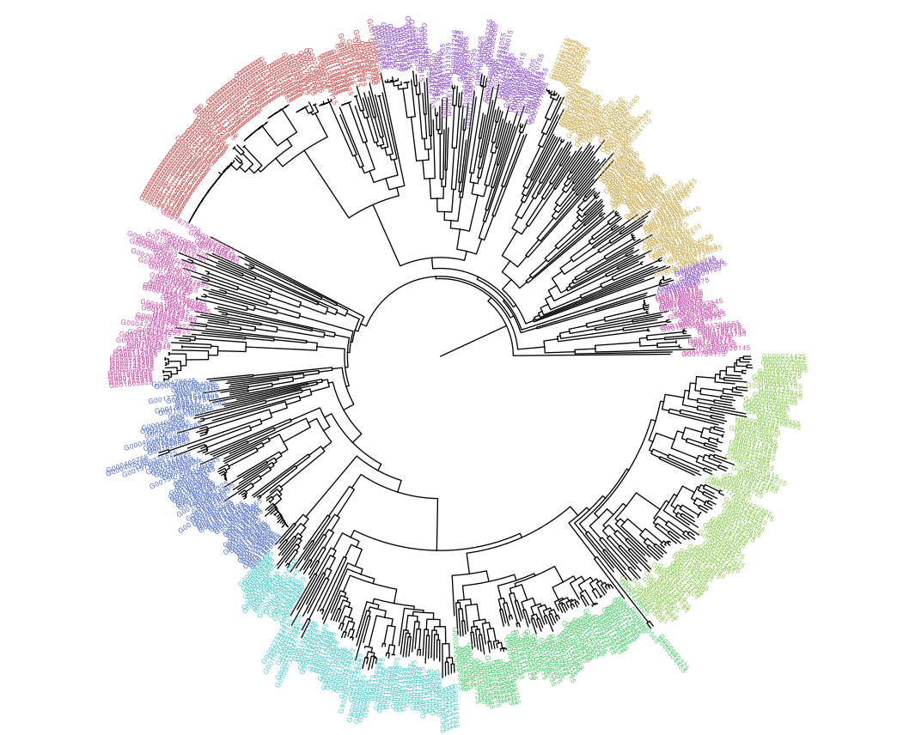

# kf2vec

Alignment-free phylogenetic placement using k-mer frequency vectors and machine learning.

---

# Installation

## Install from Bioconda

```bash
conda create -n kf2vec_env python=3.11
conda activate kf2vec_env

conda install -c bioconda kf2vec
```

Verify installation:

```bash
kf2vec --version
kf2vec --help
```

---
# Tutorial steps
The example dataset will demonstrate the following workflow:

```text
1. Split the tree into subtrees
      │
      ▼
2. Extract k-mer frequencies
      │
      ▼
3. Train classifier
      │
      ▼
4. Classify queries
      │
      ▼
5. Train distance models
      │
      ▼
6. Estimate query-to-backbone distances
      │
      ▼
7. Place queries onto the phylogeny
```


## Step 0. Obtain dataset

```bash
git clone https://github.com/noraracht/Tutorial_ISMB_data
```


---
## Step 1. Split the phylogeny and compute true distances
Note: We split the <ins>full</ins> tree into clades to keep track of the clade membership of the query sequences.

```bash
kf2vec divide_tree \
    -tree clade_11.nwk \
    -size 100
```


The full phylogeny was pruned to remove the query sequences. Pairwise distances were then computed on the <ins>pruned</ins> tree.

```bash
kf2vec get_distances \
    -tree ./train_tree/clade_11_prunned.nwk \
    -subtrees ./train_tree/train_set.subtrees
```

Output:

```text
clade_11.subtrees
clade_11_prunned_subtree_0.di_mtrx
clade_11_prunned_subtree_1.di_mtrx
...
```

---

## Step 2. Extract k-mer frequencies

```bash
kf2vec get_frequencies \
    -input_dir ./clade_11_fna_train \
    -output_dir ./clade_11_fna_train_kf

kf2vec get_frequencies \
    -input_dir ./clade_11_fna_test_p1 \
    -output_dir ./clade_11_fna_test_kf_p1
```

Output: `.kf` files containing normalized k-mer frequencies.

---

## Step 3. Train the classifier
The classifier was pretrained for 300 epochs.
```bash
kf2vec train_classifier \
    -input_dir ./clade_11_fna_train_kf \
    -subtrees ./train_tree/train_set.subtrees \
    -e 2 \
    -o ./models
```

Output:

```text
classifier_model.ckpt
```

---

## Step 4. Classify query genomes
we use <ins>pretrained</ins> model for classification.

```bash
kf2vec classify \
    -input_dir ./clade_11_fna_test_kf_p1  \
    -model ./pretrained_models \
    -o ./results_pretrained
```

Output:

```text
classes.out
```

---

## Step 5. Train distance models
The embedder was pretrained for 1000 epochs.
### Single-clade example

```bash
kf2vec train_model_set \
    -input_dir ./clade_11_fna_train_kf \
    -true_dist ./train_tree \
    -subtrees ./train_tree/train_set.subtrees \
    -clade 1 \
    -e 2 \
    -o ./models
```

### Train on all clades consecutively
```bash
kf2vec train_model_set \
    -input_dir ./clade_11_fna_train_kf \
    -true_dist ./train_tree \
    -subtrees ./train_tree/train_set.subtrees \
    -e 2 \
    -o ./models
```

Output:

```text
model_subtree_0.ckpt
model_subtree_1.ckpt
...
```

---

## Step 6. Estimate query-to-backbone distances
We use  a < ins> pretrained </ins> model for distance estimation.
```bash
kf2vec query \
    -input_dir ./clade_11_fna_test_kf_p1 \
    -model ./pretrained_models \
    -classes ./results_pretrained \
    -o ./results_pretrained
```

Output:

```text
apples_input_di_mtrx_query_*.csv
```

These files are used directly by APPLES.

---

# Query placement

Install APPLES and GAPPA:

```bash
pip install apples

conda install bioconda::gappa
```
## Merge distance matrices into a single combined matrix:
```bash
python merge_dist_mtrx.py
```

## Perform placement:

```bash
run_apples.py \
    -d ./combined_dimtrx_pretrained.tsv \
    -t ./clade_11_p1_prunned.nwk \
    -f 0 \
    -b 5 \
    -o ./clade_11_p1_inferred.jplace
```

## Convert jplace to Newick:

```bash
gappa examine graft \
    --jplace-path ./clade_11_p1_inferred.jplace \
    --allow-file-overwriting \
    --out-dir ./pl_inferred
```


---

# Command Reference

After completing the tutorial, refer to the full command documentation for:

- get_frequencies
- divide_tree
- get_distances
- train_classifier
- classify
- train_model_set
- query
- get_chunks
- train_classifier_chunks
- train_model_set_chunks
